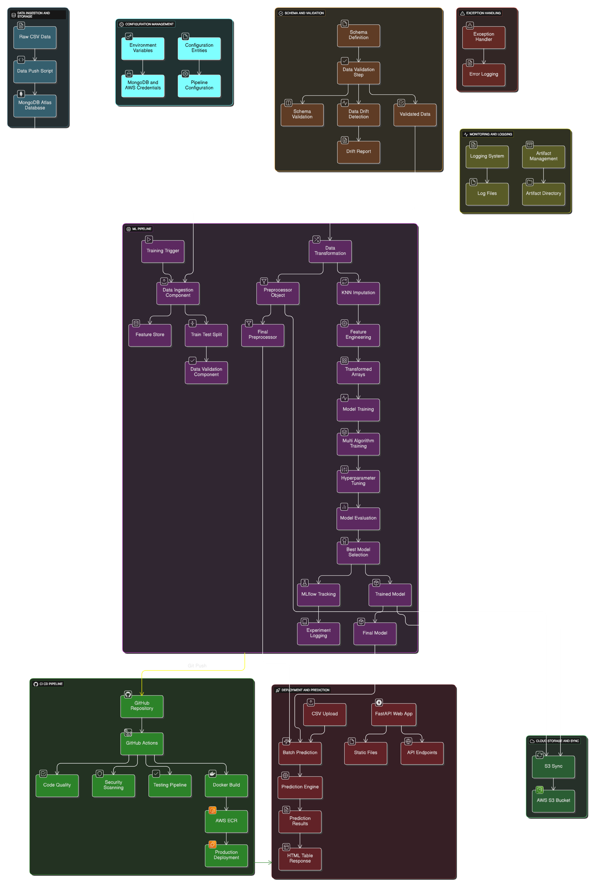

# NetworkSecurity - Enterprise Phishing Detection System

[](https://github.com/nasim-raj-laskar/Net-Sec/actions)
[](https://github.com/nasim-raj-laskar/Net-Sec/actions)
[](https://github.com/nasim-raj-laskar/Net-Sec/actions)

Production-grade MLOps system for phishing website detection leveraging modular architecture, automated CI/CD pipelines, cloud-native deployment, and comprehensive monitoring infrastructure.

## 🏗️ System Architecture

### High-Level Architecture


### Modular Component Design

```
networksecurity/
├── components/                # Core ML pipeline components
│   ├── data_ingestion.py      # MongoDB → Feature Store ETL
│   ├── data_validation.py     # Schema validation & drift detection
│   ├── data_transformation.py # Feature engineering & preprocessing
│   └── model_trainer.py       # Multi-algorithm training with MLflow
├── pipeline/                  # Orchestration layer
│   ├── training_pipeline.py   # End-to-end ML pipeline
│   └── batch_prediction.py    # Inference pipeline
├── cloud/                     # Cloud integration
│   └── s3_syncer.py           # AWS S3 artifact synchronization
├── utils/                     # Utility modules
│   ├── ml_utils/              # ML-specific utilities
│   └── main_utils/            # General utilities
└── entity/                    # Configuration & artifact entities
    ├── config_entity.py       # Pipeline configurations
    └── artifact_entity.py     # Artifact definitions
```

### Data Flow Architecture



## 🚀 CI/CD Pipeline Architecture

### Multi-Stage Pipeline Configuration

#### 1. Continuous Integration (`main.yaml`)
- **Trigger**: Push to main branch (excluding README changes)
- **Stages**: Code linting, unit testing, security scanning
- **Permissions**: OIDC token-based AWS authentication

#### 2. Continuous Delivery (Disabled - Production Ready)
```yaml
build-and-push-ecr-image:
  - AWS ECR authentication via IAM roles
  - Docker containerization with multi-stage builds
  - Image tagging with semantic versioning
  - Automated push to ECR repository
```

#### 3. Continuous Deployment (Self-Hosted Runner)
```yaml
continuous-deployment:
  - Blue-green deployment strategy
  - Container orchestration with health checks
  - Automated rollback mechanisms
  - Environment variable injection
```

### Quality Assurance Workflows

#### Code Quality Pipeline (`code-quality.yaml`)
- **Black**: Code formatting enforcement
- **isort**: Import statement organization
- **flake8**: PEP8 compliance & complexity analysis
- **mypy**: Static type checking

#### Security Scanning (`security-scan.yaml`)
- **Bandit**: AST-based security vulnerability detection
- **Safety**: Known security vulnerability database checks
- **pip-audit**: Dependency vulnerability scanning
- **Scheduled scans**: Weekly automated security audits

#### Testing Framework (`testing.yaml`)
- **Multi-version testing**: Python 3.9, 3.10, 3.11
- **Coverage reporting**: Codecov integration
- **Integration testing**: API endpoint validation
- **Docker build verification**: Container integrity checks

## ☁️ Cloud Infrastructure

### AWS Services Integration

#### Amazon ECR (Elastic Container Registry)
- **Purpose**: Docker image storage and versioning
- **Configuration**: Private repository with lifecycle policies
- **Security**: IAM-based access control with least privilege

#### Amazon S3 (Simple Storage Service)
- **Artifact Storage**: Model artifacts, preprocessors, training data
- **Bucket Structure**:
  ```
  s3://networksecurity010/
  ├── artifact/{timestamp}/     # Training artifacts
  ├── final_model/{timestamp}/  # Production models
  └── data/                     # Raw datasets
  ```
- **Synchronization**: Automated via `S3Sync` utility class

#### MongoDB Atlas Integration
- **Database**: `NASIMRL`
- **Collection**: `NetworkData`
- **Connection**: SSL/TLS encrypted with certificate validation
- **Data Pipeline**: CSV → JSON → MongoDB document store

### Infrastructure as Code
```python
# S3 Synchronization Implementation
class S3Sync:
    def sync_folder_to_s3(self, folder, aws_bucket_name):
        command = f"aws s3 sync {folder} {aws_bucket_name}/"
        os.system(command)
```

## 🔬 MLOps & Experiment Tracking

### DagsHub Integration
- **Repository**: `nasim-raj-laskar/Net-Sec`
- **MLflow Backend**: Centralized experiment tracking
- **Model Registry**: Version-controlled model artifacts
- **Collaboration**: Team-based ML experiment management

### MLflow Experiment Tracking
```python
def track_mlflow(self, best_model, classificationmetric):
    with mlflow.start_run():
        mlflow.log_metric("f1_score", classificationmetric.f1_score)
        mlflow.log_metric("precision_score", classificationmetric.precision_score)
        mlflow.log_metric("recall_score", classificationmetric.recall_score)
        mlflow.sklearn.log_model(best_model, "model")
```

### Model Training Pipeline
- **Algorithms**: Random Forest, Decision Tree, Gradient Boosting, Logistic Regression, AdaBoost
- **Hyperparameter Tuning**: GridSearchCV with cross-validation
- **Model Selection**: Automated best model selection based on performance metrics
- **Artifact Management**: Automated model and preprocessor serialization

## 📊 Data Schema & Validation

### Feature Schema (`schema.yaml`)
```yaml
numerical_columns: [30 features]
  - having_IP_Address, URL_Length, Shortining_Service
  - SSL_final_State, Domain_registration_length
  - Page_Rank, Google_Index, Statistical_report
target_column: Result (Binary Classification)
```

### Data Validation Pipeline
- **Schema Validation**: Automated column type and constraint checking
- **Data Drift Detection**: Statistical drift analysis with YAML reporting
- **Quality Metrics**: Missing value analysis, outlier detection

## 🐳 Containerization & Deployment

### Docker Configuration
```dockerfile
FROM python:3.10-slim-buster
WORKDIR /app
COPY . /app
RUN pip install --no-cache-dir awscli
RUN pip install --no-cache-dir -r requirements.txt
CMD ["python3", "app.py"]
```

### Production Deployment
- **Container Orchestration**: Docker with health checks
- **Port Configuration**: 8080 (production), 8000 (development)
- **Environment Variables**: AWS credentials, MongoDB connection strings
- **Resource Management**: Memory and CPU limits via container constraints

## 🌐 Web Application Architecture

### FastAPI Backend
- **Framework**: FastAPI with async support
- **CORS**: Cross-origin resource sharing enabled
- **Static Files**: CSS, JS, and prediction outputs
- **Template Engine**: Jinja2 for dynamic HTML rendering

### API Endpoints
```python
@app.get("/")                    # Main application interface
@app.post("/predict")            # File upload and batch prediction
@app.get("/train")               # Model training trigger
```

### Frontend Features
- **Single Page Application**: Unified interface for all operations
- **File Upload**: CSV batch processing with validation
- **Real-time Training**: Progress tracking with WebSocket support
- **Results Visualization**: Enhanced table formatting with export capabilities

## 🔧 Development Setup

### Prerequisites
- Python 3.9+
- MongoDB Atlas connection
- AWS CLI configured
- Docker (optional)

### Installation
```bash
# Clone repository
git clone https://github.com/nasim-raj-laskar/Net-Sec.git
cd NetworkSecurity

# Install dependencies
pip install -r requirements.txt
pip install -e .

# Configure environment
cp .env.example .env
# Edit .env with your MongoDB and AWS credentials

# Initialize data
python push_data.py

# Start development server
python app.py
```

### Environment Variables
```bash
MONGO_DB_URL=mongodb+srv://...
AWS_ACCESS_KEY_ID=...
AWS_SECRET_ACCESS_KEY=...
AWS_REGION=us-east-1
ECR_REPOSITORY_NAME=networksecurity
```

## 📈 Monitoring & Observability

### Logging Infrastructure
- **Structured Logging**: Timestamp-based log files in `/logs/`
- **Log Rotation**: Automated cleanup and archival
- **Error Tracking**: Exception handling with stack traces

### Performance Metrics
- **Model Performance**: F1-score, Precision, Recall tracking
- **System Metrics**: Response time, throughput monitoring
- **Resource Utilization**: Memory, CPU usage tracking

### Artifact Management
```
Artifact/{timestamp}/
├── data_ingestion/
│   ├── feature_store/phisingData.csv
│   └── ingested/{train,test}.csv
├── data_validation/
│   ├── drift_report/report.yaml
│   └── validated/{train,test}.csv
├── data_transformation/
│   ├── transformed/{train,test}.npy
│   └── transformed_object/preprocessing.pkl
└── model_trainer/
    └── trained_model/model.pkl
```

## 🚦 Production Deployment

### Quick Start
```bash
# Windows
start_server.bat

# Linux/Mac
chmod +x start_server.sh
./start_server.sh

# Manual
python app.py
```


## 📚 Technical Documentation

### Model Documentation
- **Algorithm Selection**: Ensemble methods with cross-validation
- **Feature Engineering**: KNN imputation, standardization
- **Performance Benchmarks**: >85% accuracy on test dataset

### Security Considerations
- **Input Validation**: CSV schema enforcement
- **Authentication**: JWT-based API security (future enhancement)
- **Data Privacy**: PII anonymization in logs
- **Vulnerability Management**: Automated dependency scanning


### Code Standards
- Follow PEP8 guidelines
- Maintain >80% test coverage
- Update documentation for new features
- Pass all CI/CD pipeline checks

